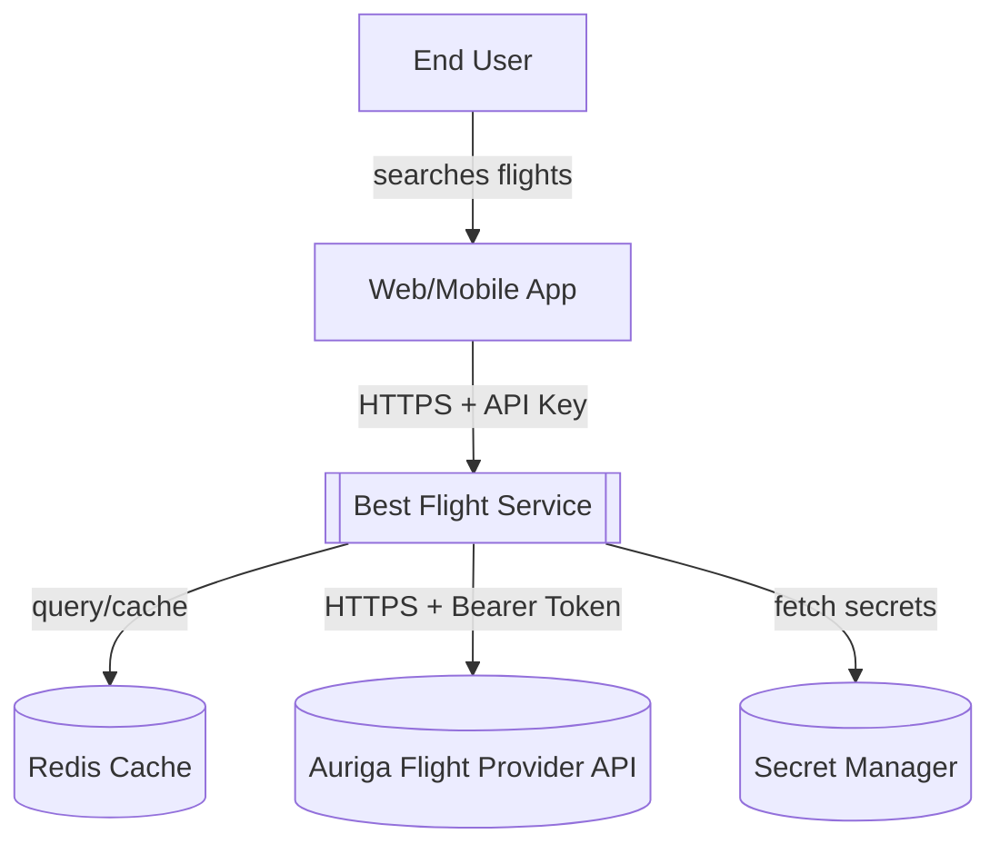
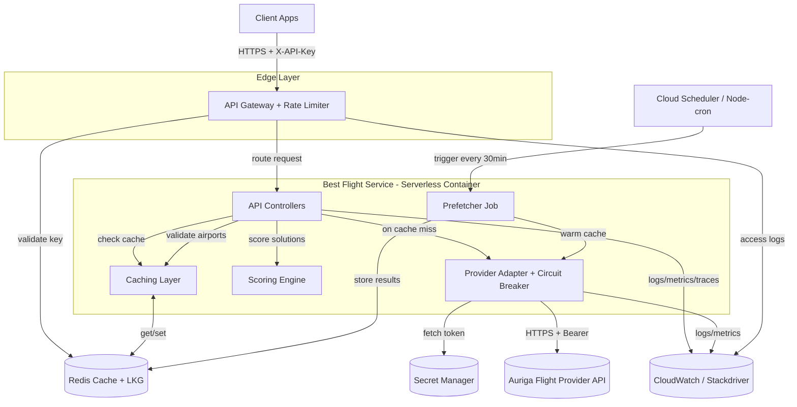

# Flight Selection Service — Software Design Specification

## Executive Summary
This document specifies a scalable Node.js/TypeScript service that consumes the Auriga Flight Comparison API to return optimal flight solutions between airports. The system handles 250k-1M daily users through intelligent caching (85%+ hit rate), horizontal scaling, and cost-effective API usage patterns. Core focus: price-based optimization with extensible scoring for future enhancements.

## 0. Assumptions & Constraints
- **Provider API limitations**: No departure/arrival times or durations exposed. "Fastest" mode deferred to Phase 2 pending schedule data integration.
- **API pricing model**: Assumed pay-per-call; targeting <15% of requests hitting upstream via aggressive caching.
- **Update frequency**: Flight data assumed to refresh every 15-30 minutes; reference data (airports/airlines) daily.
- **Currency**: All prices in EUR (to be confirmed with provider).
- **Multi-segment journeys**: Provider returns `Flight[][]` where inner arrays represent connected segments forming a complete journey.
- **Authentication**: Service uses API keys for client auth; provider requires Bearer token (stored in secret manager).

## 1. Overview
- **Objective**: Build a scalable service that, by consuming the provided Flight Comparison API, returns the best* flight(s) for a user between two airports.
- **Tech stack (core logic)**: Node.js + TypeScript.
- **Primary consumers**: Web/mobile clients and internal services via a public service API.
- **Key constraints**:
  - Average daily users: 250k. Peak: 1M.
  - API requires Bearer authentication.
  - “Best*” is configurable per scenario and user preferences.

## 2. External API
- **Server**: `https://aurigaspa.com/flight-engine/api`
- **Security**: Bearer token (`Authorization: Bearer <token>`)
- **Endpoints**:
  - `GET /flights/all` → `FlightsCollection` (array of `Flight`)
  - `GET /flights/from/{departureCode}/to/{arrivalCode}` → `TravelSolutions` (array of arrays of `Flight`, ordered by increasing price)
  - `GET /airports/all` → `AirportsCollection`
  - `GET /airlines/all` → `AirlinesCollection`
- **Data models (essential fields)**:
  - `Flight`: `id`, `airlineId`, `departureAirportId`, `arrivalAirportId`, `price`
  - `Airport`: `id`, `codeIata`, `latitude`, `longitude`
  - `Airline`: `id`, `name`, `codeIataPrefix`, `logoFilename`

## 3. Goals and Non-Goals
- **Goals**
  - Return best* flight(s) with low latency (<250 ms p95 after warm cache; <1.5 s cold).
  - Keep external API usage cost-effective via caching, prefetching, and rate limiting.
  - Handle peak load elastically.
  - Provide observability and safe fallbacks.
- **Non-Goals**
  - Building a booking engine or payment flow.
  - Long-term historical analytics (beyond operational metrics).

## 4. Best* Definition Scenarios
- **Cheapest (MVP)**: Minimize total journey price (sum of all segment prices). Default mode; provider pre-sorts by price.
- **Fewest Stops (MVP)**: Minimize segment count. Useful for convenience over price.
- **User Preferences (MVP)**: Apply filters for airline whitelist/blacklist, max stops, max price before scoring.

### Multi-Segment Journey Handling
- **Total Price**: Sum of `price` across all segments in a solution.
- **Stops Count**: `segments.length - 1` (e.g., 2 segments = 1 stop).
- **Segment Validation**: Verify `segments[i].arrivalAirportId === segments[i+1].departureAirportId` for connectivity.
- **Journey ID**: Hash of segment IDs for deduplication and caching.

## 5. Assumptions and Scenarios
- **API Cost**
  - Cost per call may apply; aim for cache hit rate ≥ 85% during peak via route-based caching and prefetching of top O&D (origin and destination) pairs.
- **Update Frequency**
  - If upstream refreshes hourly: set TTL ≈ 10–20 min for volatile data; daily for reference data (airports/airlines) with ETag checks.
  - Support cache versioning to flush on detected upstream changes.
- **Availability**
  - Upstream SLA unknown; implement circuit breaker and graceful degrade to last-known good (LKG) cache for ≤ 30 min.

## 6. High-Level Architecture
- **Client** → **API Gateway/Edge** → **Best Flight Service (Node/TS)**
  - Integrations:
    - **Flight Provider Client** (HTTP, bearer token)
    - **Cache**: Redis (managed) for route queries, Last Known Good (LKG) objects, and session data
    - **DB**: Postgres for user prefs and audit logs (optional: defer to Phase 2 if Redis persistence sufficient)
    - **Scheduler**: Node-cron or Cloud Scheduler for periodic cache warmup of top routes
    - **Observability (MVP)**: Cloud-native tools (AWS CloudWatch/X-Ray or GCP Cloud Monitoring/Cloud Trace) for metrics, logs, and traces
    - **Observability (Phase 2)**: OpenTelemetry, Prometheus, Grafana for vendor-neutral, advanced observability
    - **Secret Manager**: AWS Secrets Manager / GCP Secret Manager for provider bearer token
  - **Deferred to Phase 2**: Message queue (Kafka/SQS) for high-volume prefetch, CDN for edge caching

## 6.1 Authentication & Authorization
- **Client → Service**: API Key authentication via `X-API-Key` header
  - Keys stored in Redis with rate limit metadata
  - Key rotation supported via admin API
  - Optional: JWT tokens for user-specific preferences (Phase 2)
- **Service → Provider**: Bearer token from secret manager, rotated every 90 days
- **Rate Limiting**: 
  - Per API key: 100 requests/minute (burst: 150)
  - Per route key: 10 requests/minute to prevent cache stampede
  - Global: 500 QPS at peak (horizontal scaling trigger)

## 7. Service Responsibilities
- **Best Flight API**
  - `GET /v1/best-flight?from=AAA&to=BBB&mode=cheapest|fewest-stops&maxStops=&maxPrice=&airlines=&excludeAirlines=`
  - `GET /v1/airports` and `GET /v1/airlines` (cached passthrough with 24h TTL)
  - `GET /v1/health` (liveness/readiness probes)
- **Provider Adapter**
  - Wraps `GET /flights/from/{from}/to/{to}` with retry logic
  - Retries: 3 attempts, exponential backoff (100ms, 200ms, 400ms) with jitter
  - Circuit breaker: trip after 5 consecutive failures or 50% error rate in 30s window
  - Timeout: 1200ms per request
- **Caching Layer**
  - Key format: `route:{from}:{to}:v1:{hash(mode,filters)}`
  - TTL: 15 min for flight data; 24h for reference data (airports, airlines)
  - Negative caching: 404 errors cached for 5 min to prevent repeated invalid lookups
  - Cache versioning: increment `v1` when scoring logic changes
- **Scoring Engine**
  - Deterministic scoring based on mode (cheapest, fewest-stops, other)
  - Normalization: price and stops normalized using min-max from current result set
  - Cold start: use static percentiles (p50 price: €200, p50 stops: 1) until 100+ queries collected
- **Prefetcher**
  - Cron job every 30 min to warm top 1000 routes (based on previous 7-day query logs)
  - Stores results in Redis with extended TTL (60 min) and `prefetched=true` flag

## 8. Data Model (Internal)
- **RouteResult**
  - `fromIata`, `toIata`, `solutions: Flight[][]`, `providerVersion`, `fetchedAt`
- **ScoredSolution**
  - `solutionId`, `score`, `price`, `stops`, `segments: Flight[]`, `explanations[]`
- **Reference**
  - `Airport(id, codeIata, lat, lon)`
  - `Airline(id, name, codeIataPrefix, logoFilename)`
- **UserPrefs**
  - `maxStops`, `maxPrice`, `preferredAirlines[]`, `blockedAirlines[]`, `weights{price,duration,stops}`

## 9. Algorithm (Cheapest default)
1. Resolve `from`, `to` IATA, validate via cached airports.
2. Check Redis for `route:{from}:{to}:criteria:{hash}`.
3. On cache hit → return top N with metadata.
4. On miss → call provider `GET /flights/from/{from}/to/{to}`.
5. Filter by prefs; compute score according to mode.
6. Persist result in Redis (and optionally Postgres for audit/LKG).
7. Return top 1 (or top K for client-side choice).

## 10. Error Handling and Resiliency

### 10.1 Error Response Format
All errors return JSON with:
```json
{
  "error": {
    "code": "ERROR_CODE",
    "message": "Human-readable description",
    "details": {},
    "requestId": "uuid"
  }
}
```

### 10.2 Error Codes
| HTTP | Code | Description | Retry? |
|------|------|-------------|--------|
| 400 | `INVALID_IATA_CODE` | Airport code must be 3 uppercase letters | No |
| 400 | `INVALID_MODE` | Mode must be: cheapest, fewest-stops, balanced | No |
| 400 | `INVALID_FILTERS` | maxStops/maxPrice must be positive numbers | No |
| 401 | `INVALID_API_KEY` | Missing or invalid X-API-Key header | No |
| 404 | `AIRPORT_NOT_FOUND` | Departure or arrival airport not found | No |
| 404 | `NO_FLIGHTS_FOUND` | No flights available for this route | Yes (5m) |
| 429 | `RATE_LIMIT_EXCEEDED` | Too many requests, retry after N seconds | Yes |
| 500 | `INTERNAL_ERROR` | Unexpected server error | Yes |
| 502 | `UPSTREAM_ERROR` | Provider API unavailable | Yes |
| 503 | `SERVICE_UNAVAILABLE` | Circuit breaker open, using cached data | Yes |
| 504 | `UPSTREAM_TIMEOUT` | Provider API timeout | Yes |

### 10.3 Resiliency Patterns
- **Rate limiting**: Token bucket per API key (100/min) and per route (10/min)
- **Retries**: 3 attempts with exponential backoff (100ms, 200ms, 400ms) + jitter
- **Circuit breaker**: Open after 5 failures or 50% error rate; half-open after 30s; serve LKG during open state
- **Timeouts**: Provider 1200ms, total request 2000ms
- **Input validation**: 
  - IATA: `^[A-Z]{3}$`
  - maxStops: integer 0-5
  - maxPrice: float > 0
  - airlines/excludeAirlines: comma-separated IATA prefixes `^\d{3}(,\d{3})*$`
- **Graceful degradation**: Return LKG cache with `source: "cache-fallback"` and warning header

## 11. Caching and Freshness Strategy
- **Flights**: TTL 10–30 min; invalidate by schedule (cron) and on anomaly detection (sudden price shift > X%).
- **Airports & Airlines**: TTL 24 h with background refresh.
- **Stale-while-revalidate (SWR)**: Serve cached result and refresh in background for hot routes.

### 11.1 Last Known Good (LKG) Fallback
LKG is a resilience mechanism that serves stale but valid data when the provider API is unavailable.

**Storage**:
- Key format: `lkg:route:{from}:{to}:v1`
- Stored in Redis with extended TTL (60 min) or via Redis persistence (AOF)
- Retains last 1–3 successful snapshots per route

**Trigger Conditions**:
- Provider API returns 5xx errors or times out (>1200ms)
- Circuit breaker is open (after 5 consecutive failures or 50% error rate)
- Rate limit exceeded on provider (429)

**Behavior**:
- Serve LKG data for ≤30 min during outages
- Response includes `source: "cache-fallback"` and warning message
- After 30 min of staleness, return error to client (data too old)

**Benefits**: Maintains service availability during provider outages, helps achieve 99.9% SLA target.

## 12. Scaling Plan
- **Traffic assumptions**
  - Avg 250k DAU → ~3 QPS sustained (if 1 search/user/day), but peaks and bursts matter. For peak 1M DAU and 10x burst factor: plan for 300–500 QPS.
  - With CDN/Redis hits ≥ 85%, upstream calls ≤ 75 QPS during peak.

### 12.1 Compute (MVP - Serverless Containers)
- **Platform**: Google Cloud Run / Azure Container Apps / AWS App Runner
- **Configuration**:
  - Container: 1 vCPU, 2GB RAM per instance
  - Min instances: 2 (avoid cold starts)
  - Max instances: 50 (auto-scale based on concurrency)
  - Concurrency: 80 requests per instance
- **Auto-scaling**: Platform-managed based on request load
- **Benefits**: Zero cluster management, pay-per-use, built-in load balancing

### 12.2 Compute (Phase 2 - Kubernetes)
- **When to migrate**: Multi-cloud needs, advanced networking, cost optimization at scale
- **Setup**: GKE/AKS/EKS with HPA on CPU+latency
- **Scaling**: Start 3–5 pods (1 vCPU/2GB), scale to 20–30 at peak

### 12.3 Data Tiers
- **Redis**: Managed service (ElastiCache/Memorystore/Azure Cache) with 3 shards, ~5–10 GB memory
- **Postgres**: Managed service (RDS/Cloud SQL/Azure Database) with read replicas if needed (Phase 2)

### 12.4 Edge (Phase 2)
- CDN caching of GET `/v1/best-flight` for 60–120 s if query hash identical and privacy allows

## 13. Cost Effectiveness
- **Reduce provider calls** via:
  - High Redis hit rate (target 85%+), SWR, prefetching top 1000 routes
  - Request deduplication: coalesce concurrent identical requests (single-flight pattern)
  - Negative caching: cache 404s for 5 min to avoid repeated invalid lookups
- **Tune TTLs** per seasonality and route volatility (15-30 min dynamic)
- **Cost tracking**: 
  - Metric: `provider_api_calls_total` with labels `route`, `cache_hit`
  - Dashboard: cost/day, cost/request, cache hit rate impact
  - Alert: if daily cost >$1,500 (anomaly detection)
- **Request coalescing**: Gateway-level dedup for identical concurrent requests

## 14. Maintainability and DevEx

### 14.1 Repo Structure
- `apps/api` (Fastify/Express + zod validation)
- `packages/provider-client` (OpenAPI-generated TS client)
- `packages/scoring` (pure functions + tests)
- `packages/types` (shared DTOs)

### 14.2 Testing
- **Unit**: Scoring logic, filters, validation (start on Node.js test runner, consider Jest or Vitest later)
- **Contract**: Provider API mocks (MSWjs)
- **E2E**: API flows with real Redis (Testcontainers)
- **Load**: k6 or Artillery for 500 QPS target

### 14.3 CI/CD
**MVP (Serverless Containers)**:
- Pipeline: GitHub Actions / GitLab CI / Azure DevOps
- Steps: Lint → Typecheck → Test → Build container → Push to registry → Deploy to Cloud Run/Container Apps
- Deployment: Direct deployment via CLI/Terraform
- Rollback: Platform-managed traffic splitting (blue/green)

**Phase 2 (Kubernetes)**:
- GitOps with ArgoCD/Flux
- Helm charts for declarative deployments

### 14.4 Feature Flags
- Use LaunchDarkly, Flagsmith, or cloud provider feature flags
- Toggle scoring strategies (cheapest vs. fewest-stops)
- Gradual rollout of new features

## 15. Security and Compliance
- Store provider bearer token in secret manager (cloud provider KMS-backed), rotate regularly.
- TLS everywhere, HSTS at edge (Strict-Transport-Security: max-age=31536000).
- PII minimization; treat airports/airlines as non-PII.
- Input sanitization; outbound allowlist to provider domain.

## 16. API Contract (Service)

### 16.1 GET /v1/best-flight
**Request**:
```
GET /v1/best-flight?from=JFK&to=LAX&mode=cheapest&maxStops=1&maxPrice=500
Headers:
  X-API-Key: your-api-key-here
```

**Response (200 OK)**:
```json
{
  "best": {
    "journeyId": "hash-abc123",
    "totalPrice": 299.50,
    "currency": "EUR",
    "stops": 0,
    "score": 0.85,
    "segments": [
      {
        "id": 12345,
        "airlineId": 1,
        "airlineName": "Example Airlines",
        "departureAirportId": 101,
        "departureCode": "JFK",
        "arrivalAirportId": 202,
        "arrivalCode": "LAX",
        "price": 299.50
      }
    ],
    "explanation": "Cheapest direct flight"
  },
  "alternatives": [
    {
      "journeyId": "hash-def456",
      "totalPrice": 325.00,
      "currency": "EUR",
      "stops": 1,
      "score": 0.78,
      "segments": [...],
      "explanation": "One stop via ORD"
    }
  ],
  "metadata": {
    "source": "cache",
    "fetchedAt": "2025-10-29T08:30:00Z",
    "cacheAge": 120,
    "requestId": "req-uuid-789"
  }
}
```

**Response (404 Not Found)**:
```json
{
  "error": {
    "code": "NO_FLIGHTS_FOUND",
    "message": "No flights available from JFK to LAX",
    "details": {
      "from": "JFK",
      "to": "LAX"
    },
    "requestId": "req-uuid-790"
  }
}
```

### 16.2 GET /v1/airports
**Response**: Cached passthrough of provider `/airports/all` with 24h TTL

### 16.3 GET /v1/airlines
**Response**: Cached passthrough of provider `/airlines/all` with 24h TTL

## 17. Deployment

### 17.1 MVP (Serverless Containers)
- **Environments**: dev, staging, prod
- **Platform**: Cloud Run / Azure Container Apps / AWS App Runner
- **IaC**: Terraform or cloud provider CLI (gcloud, az, aws)
- **Rollout**: Platform-managed traffic splitting (0% → 10% → 50% → 100%)
- **Rollback**: Automatic on health check failures or manual via CLI
- **Config**: Environment variables injected from Secret Manager

### 17.2 Phase 2 (Kubernetes)
- **IaC**: Terraform + Helm charts
- **GitOps**: ArgoCD or Flux for declarative deployments
- **Rollout**: Canary with Flagger (gradual traffic shift based on metrics)
- **Rollback**: Automated on SLO violation (latency, error rate)

## 18. Monitoring, Alerting & Observability

### 18.1 Key Metrics
| Metric | Target | Alert Threshold |
|--------|--------|----------------|
| p95 Latency (warm) | <250ms | >300ms for 5 min |
| p95 Latency (cold) | <1500ms | >2000ms for 5 min |
| Cache Hit Rate | ≥85% | <80% for 10 min |
| Error Rate | <0.5% | >1% for 5 min |
| Provider API Success | >99% | <95% for 5 min |
| Circuit Breaker Trips | 0/hour | >3/hour |
| QPS | 3-500 | >600 (scale trigger) |
| Redis Memory | <8GB | >9GB |
| API Key Rate Limits | <50 hits/min | >100 hits/min per key |

### 18.2 Dashboards
- **Service Health**: Latency percentiles, error rates, throughput
- **Cache Performance**: Hit/miss rates, eviction rates, memory usage
- **Provider Integration**: Success rate, latency, circuit breaker state
- **Business Metrics**: Top routes, mode distribution, average price
- **Cost Tracking**: Provider API calls/hour, estimated cost/day

### 18.3 Alerts (PagerDuty, etc.)
- **P0 (Immediate)**: Service down, error rate >5%, provider circuit breaker open >10 min
- **P1 (15 min)**: Latency >2s, cache hit rate <70%, Redis connection failures
- **P2 (1 hour)**: Cache hit rate <80%, unusual traffic patterns, cost anomalies

### 18.4 Logging
- **Structured JSON logs** with fields: `requestId`, `apiKey`, `from`, `to`, `mode`, `latency`, `cacheHit`, `error`
- **Log levels**: ERROR (5xx, circuit breaker), WARN (cache miss, slow query), INFO (requests), DEBUG (scoring details)
- **Retention**: 7 days hot, 30 days cold storage

### 18.5 Tracing
**MVP (Cloud-Native)**:
- AWS X-Ray or GCP Cloud Trace for distributed tracing
- Automatic instrumentation for HTTP requests, Redis calls
- Sample rate: 100% for errors, 10% for success, 100% for requests >1s

**Phase 2 (OpenTelemetry)**:
- Vendor-neutral spans for: API request, cache lookup, provider call, scoring, response serialization
- Exporters to Jaeger/Tempo for advanced trace analysis
- Same sampling strategy with custom span attributes

## 19. KPIs and SLOs
- **p95 latency**: <250 ms (warm cache), <1.5 s (cold cache)
- **p99 latency**: <500 ms (warm), <2.5 s (cold)
- **Availability**: 99.9% monthly (43 min downtime/month)
- **Cache hit rate**: ≥ 85% during peak hours
- **Error budget**: 0.1% (720 failed requests per 720k requests)
- **Provider API usage**: <15% of total requests (cost optimization)
- **Time to recovery**: <5 min for service restarts, <15 min for provider outages (via LKG cache)

## 20. Sequence (Happy Path)
1. Client calls `/v1/best-flight?from=AAA&to=BBB&mode=cheapest`.
2. Service validates and checks Redis.
3. Cache miss triggers provider call; response scored and cached.
4. Service returns best solution with `source=live` and sets SWR refresh.

## 21. C4 Diagrams (Mermaid)

### C1 — System Context


### C2 — Container Diagram (MVP)


**Notes**: 
- Postgres and message queue deferred to Phase 2
- Redis persistence (AOF) enabled for LKG storage
- Observability uses cloud-native tools (CloudWatch/Stackdriver) for MVP
- Service runs as serverless containers (Cloud Run/Container Apps/App Runner)

---

## 22. Disaster Recovery & Data Retention
- **Redis**: AOF persistence enabled; daily snapshots to S3; RTO <10 min via snapshot restore
- **Secrets**: Versioned in secret manager; previous version retained for 30 days
- **Logs**: 7 days in hot storage (Elasticsearch), 30 days in cold (S3), then deleted
- **Metrics**: 90 days retention in Prometheus, 1 year aggregated in long-term storage
- **Backups**: Redis snapshots retained for 7 days

## 23. Future Enhancements (Phase 2+)
- **Kubernetes migration**: Move from serverless containers to GKE/AKS/EKS for multi-cloud portability and fine-grained control
- **OpenTelemetry observability**: Vendor-neutral tracing and metrics with Prometheus/Grafana/Jaeger
- **Fastest mode**: Integrate schedule API (e.g., FlightAware, OAG) for departure/arrival times
- **User accounts**: JWT authentication, saved preferences, search history
- **Price alerts**: Notify users when prices drop below threshold
- **Multi-city**: Support complex itineraries (A→B→C)
- **Seat availability**: Integrate real-time seat maps
- **Carbon footprint**: Display CO2 emissions per flight
- **Message queue**: Kafka/SQS for high-volume prefetch and async analytics
- **CDN**: Edge caching for global latency optimization
- **ML-based scoring**: Predict user preferences based on historical behavior
- **A/B testing**: Framework for scoring algorithm experiments

## 24. Compliance & Privacy (GDPR/CCPA)
- **Data minimization**: No PII stored unless user accounts added in Phase 2
- **Right to deletion**: API for user data deletion (if user accounts exist)
- **Data retention**: Audit logs anonymized after 30 days (remove API key associations)
- **Consent**: Cookie banner for analytics (if web UI added)
- **Data processing agreement**: Required with provider if handling EU user data

---

## Appendix A — Mapping to Provider Schemas
- Use `TravelSolutions.data: Flight[][]` for multi-segment journeys
- Each inner `Flight[]` array represents a complete journey with connected segments
- Map `Airline.id` to `Flight.airlineId` for display and filtering
- Validate IATA with regex `^[A-Z]{3}$` and cross-check against cached `AirportsCollection`
- Segment connectivity validation: `segments[i].arrivalAirportId === segments[i+1].departureAirportId`

## Appendix B — Performance Benchmarks (Target)
**Per Container Instance (1 vCPU, 2GB RAM, 80 concurrency)**:
- **Sustained throughput**: 50-100 QPS per instance
- **Cold start**: <2s (mitigated by min instances = 2)
- **Redis lookup**: <5ms p95
- **Provider API call**: 200-800ms p95 (network dependent)
- **Scoring computation**: <10ms for 50 solutions
- **Total warm path**: <50ms (cache hit) + serialization
- **Total cold path**: <1200ms (provider) + 50ms (scoring/caching)

**Scaling Behavior**:
- At 300 QPS peak: ~6-8 active instances
- At 500 QPS burst: ~10-12 active instances
- Platform auto-scales based on request concurrency

## Appendix C — Cost Estimation (Monthly)
Assumptions: 500k DAU average, 1.5 searches/user/day = 750k requests/day = 22.5M/month

### MVP (Serverless Containers)
| Component | Cost | Notes |
|-----------|------|-------|
| Compute (Cloud Run/Container Apps) | $150-250 | ~5M vCPU-seconds, 10GB-seconds RAM |
| Redis (10GB managed) | $150 | ElastiCache/Memorystore/Azure Cache |
| Provider API (3.4M (22.5M*15%) calls @ $0.01/call) | $34,000 | 85% cache hit rate |
| Observability (CloudWatch/Stackdriver) | $50-100 | Logs, metrics, traces |
| Secret Manager | $10 | Token storage and rotation |
| **Total** | **~$34,400/month** | |

**Cost optimization**: 
- With 85% cache hit rate, provider calls = 3.4M/month
- Each 1% cache hit improvement saves ~$2,250/month
- Serverless compute: pay only for actual request time (vs. always-on pods)

### Phase 2 (Kubernetes)
Compute cost may decrease to $100-150/month with reserved instances at sustained load, but adds operational overhead.
